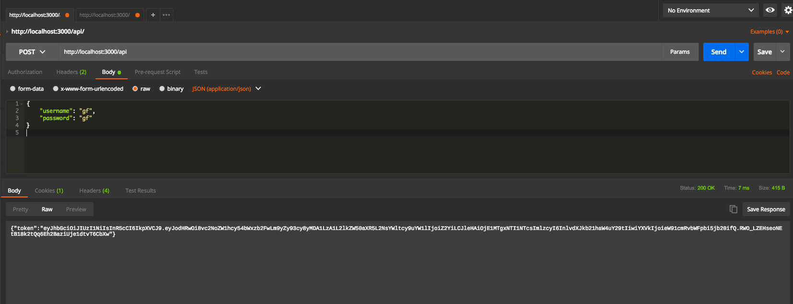
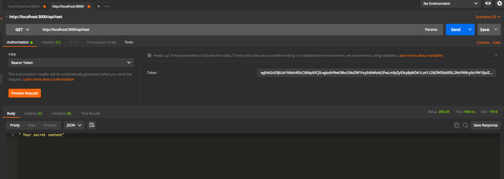

# ASP.NET Core 2 JWT API
###Steps to run:
### Using Docker:
# ```diff
# + $ docker build -t aspnetapp .
# + $ docker run -d -p 5000:80 --name myapp aspnetapp
# ``` 
#### app running at localhost:5000

### Using ASP.NET Core 2 SDK:

```diff
+ $ dotnet restore && (dotnet build | dotnet run)
```
#### Check the service using Postman or other tool

#### POST method generating token for hardcoded credentials 

#### GET method response payload

